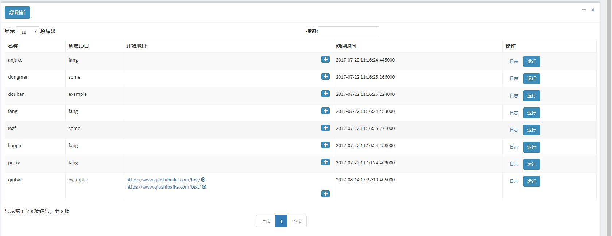

# 这个项目是干什么的
> 这是本人自用的scrapy工作站，包括两部分，master端和minion端，由基于scrapy和flask。

- master端是一个web程序，通过web，能控制爬虫的启停。
- minion端负责爬虫线程管理。
- 这只是个半成品，后续功能可能有
    - [ ] 用户认证
    - [ ] 计划任务
    - [ ] 。。。

# 结构图

# 文档
暂时没有文档，看源代码吧。

# demo

# 采用 MIT 开源许可证

MIT License

Copyright (c) 2017 gooken

Permission is hereby granted, free of charge, to any person obtaining a copy
of this software and associated documentation files (the "Software"), to deal
in the Software without restriction, including without limitation the rights
to use, copy, modify, merge, publish, distribute, sublicense, and/or sell
copies of the Software, and to permit persons to whom the Software is
furnished to do so, subject to the following conditions:

The above copyright notice and this permission notice shall be included in all
copies or substantial portions of the Software.

THE SOFTWARE IS PROVIDED "AS IS", WITHOUT WARRANTY OF ANY KIND, EXPRESS OR
IMPLIED, INCLUDING BUT NOT LIMITED TO THE WARRANTIES OF MERCHANTABILITY,
FITNESS FOR A PARTICULAR PURPOSE AND NONINFRINGEMENT. IN NO EVENT SHALL THE
AUTHORS OR COPYRIGHT HOLDERS BE LIABLE FOR ANY CLAIM, DAMAGES OR OTHER
LIABILITY, WHETHER IN AN ACTION OF CONTRACT, TORT OR OTHERWISE, ARISING FROM,
OUT OF OR IN CONNECTION WITH THE SOFTWARE OR THE USE OR OTHER DEALINGS IN THE
SOFTWARE.